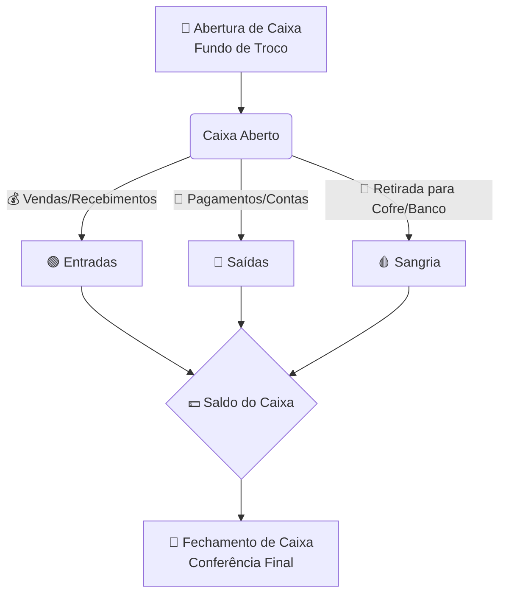

# 📘 Manual do Usuário: Gestão Financeira Descomplicada

Bem-vindo ao manual de utilização do nosso Sistema Financeiro (Livro Caixa). Este guia foi criado especialmente para você, com o objetivo de tornar o controle do seu dinheiro simples, prático e sem dores de cabeça. 

Aqui, vamos explicar os conceitos básicos e o passo a passo para você manter a saúde financeira do seu negócio sempre em dia!

---

## 💡 1. Entendendo os Conceitos Básicos

Antes de mexer no sistema, é importante entender o que significam alguns termos do dia a dia de quem lida com o caixa.

### 🟢 Entradas (Receitas)
É **tudo o que entra** de dinheiro no seu caixa. 
*Exemplo: Venda de um produto, recebimento de um serviço prestado, troco inicial.*

### 🔴 Saídas (Despesas)
É **tudo o que sai** de dinheiro do seu caixa para pagar alguma coisa.
*Exemplo: Pagamento de fornecedores, conta de luz, compra de material de escritório, pagamento de funcionários.*

### 🔓 Abertura de Caixa
É a primeira ação do dia! Significa registrar com quanto dinheiro o seu caixa está começando o dia (o famoso "Fundo de Troco").
*Exemplo: Você abriu a loja às 8h e colocou R$ 100,00 em notas trocadas na gaveta. Sua abertura de caixa é de R$ 100,00.*

### 🩸 Sangria de Caixa (Retirada)
O nome parece estranho, mas é simples: a Sangria é a **retirada de dinheiro físico** do caixa por motivo de segurança ou para depósito bancário. 
Quando o caixa fica muito cheio de dinheiro, é perigoso manter tudo ali. Então, você retira uma parte (sangria) e guarda no cofre ou deposita no banco.
*Importante: A sangria não é um gasto (despesa), é apenas uma transferência de local (do caixa para o cofre/banco).*

### 🔒 Fechamento de Caixa
É a última ação do dia. É o momento de conferir se o dinheiro físico (ou no sistema) bate com tudo o que foi registrado de Entradas e Saídas.
**Matemática do Fechamento:**
`Abertura de Caixa + Entradas - Saídas - Sangrias = Saldo Final do Dia`

---

## ⚙️ 2. Como Funciona o Fluxo de Caixa?

Para visualizar melhor como o dinheiro se movimenta durante o dia, preparamos o fluxo abaixo:

---

## 🏦 3. Organizando as Contas de Banco

Muitas vezes, a empresa tem dinheiro na gaveta (Caixa Físico) e dinheiro no Banco (Conta Corrente, PIX, etc). É fundamental separar as coisas no sistema:

1. **Caixa Físico:** Dinheiro em espécie (notas e moedas) que fica na sua gaveta da loja.
2. **Conta Banco X:** Movimentações que acontecem apenas no banco (transferências, PIX recebido, pagamento de boletos online).
3. **Conta Banco Y:** Se tiver mais de um banco, crie contas separadas no sistema.

**Dica de Ouro:** Nunca misture o dinheiro pessoal do dono com o dinheiro da empresa. A empresa deve ter a própria conta bancária! Para pagar uma conta pessoal, faça uma transferência (retirada/distribuição de lucros) da conta da empresa para a conta da pessoa física primeiro.

---

## 💻 4. Passo a Passo: Utilizando o Sistema (StockCell)

Abaixo, preparamos um guia passo a passo detalhando as principais telas do módulo de **Controle de Caixa** do sistema. 

> *Nota: Para deixar este manual com a sua cara, tire printscreens (fotos da tela) do sistema funcionando e substitua os espaços indicados abaixo pelas imagens correspondentes!*

### 🔓 4.1 Abertura de Caixa
Esta é a primeira tela que você verá ao acessar o módulo de caixa no início do expediente.

> **[ 🖼️ INSERIR PRINTSCREEN AQUI: Tela de "Caixa Fechado" mostrando o campo "Saldo Inicial" e o botão "Abrir Caixa" ]**

**Como fazer:**
1. Verifique quanto dinheiro físico você tem na gaveta para começar o dia (o seu "Fundo de Troco").
2. Digite esse valor no campo **Saldo Inicial (R$)** (ex: `100,00`).
3. Clique no botão azul **🔓 Abrir Caixa**. 
4. Pronto! O sistema registrará a data, a hora e o operador responsável pela abertura.

---

### 🟢 4.2 Visão Geral do Caixa Aberto
Uma vez aberto, a tela muda completamente e passa a ser o seu "painel de controle" diário.

> **[ 🖼️ INSERIR PRINTSCREEN AQUI: Tela "Caixa Aberto" mostrando os KPIs (Saldo Inicial, Vendas, Sangrias, etc) ]**

**O que você encontra aqui:**
- **Indicadores (KPIs):** O sistema soma tudo automaticamente e mostra um resumo no topo:
  - Seu **Saldo Inicial**.
  - O total de **Vendas** e receita bruta.
  - O total de **Sangrias** (saídas) e **Suprimentos** (entradas avulsas).
  - O **Dinheiro Esperado em Caixa** (que é o valor em cédulas e moedas que DEVE estar na gaveta baseando-se nas vendas em dinheiro).
- **Vendas por Forma de Pagamento:** Mostra o quanto você faturou dividido por Dinheiro, PIX, Débito, Crédito e A Prazo.
- **Movimentações:** Uma tabela detalhada (Hora, Tipo, Valor, Motivo, Operador) listando todas as alterações manuais feitas no caixa durante o dia.

---

### 📥 4.3 Registrando Sangrias e Suprimentos
Na base da tela do caixa aberto, existem três botões de ação essenciais.

> **[ 🖼️ INSERIR PRINTSCREEN AQUI: Tela exibindo a Janela de "Registrar Sangria" com os campos Valor e Motivo ]**

**Quando usar:**
- **📤 Sangria:** Use este botão quando precisar RETIRAR dinheiro físico da gaveta. Por exemplo: depositar no banco, pagar um fornecedor, ou guardar no cofre por segurança.
  - *Ação:* Clique em Sangria, digite o **Valor (R$)**, informe o **Motivo** (ex: "Pagamento fornecedor") e confirme.
- **📥 Suprimento:** Use este botão quando precisar COLOCAR dinheiro físico extra na gaveta (que não seja de uma venda). Por exemplo: você foi ao banco e trouxe mais R$ 50,00 trocados.
  - *Ação:* Clique em Suprimento, informe o **Valor (R$)**, descreva o **Motivo** (ex: "Troco extra trazido do banco") e confirme.

---

### 🔒 4.4 O Fechamento de Caixa
No fim do expediente, é hora de "bater o caixa". O sistema faz as contas matemáticas por você e mostra quanto deveria ter em gaveta.

> **[ 🖼️ INSERIR PRINTSCREEN AQUI: Tela do Modal de "Fechar Caixa" mostrando o "Valor esperado em dinheiro" e o campo "Valor Contado" ]**

**Como fazer um fechamento perfeito:**
1. Clique no botão vermelho **🔒 Fechar Caixa**.
2. **Não olhe para a tela ainda!** Primeiro, vá na gaveta física e conte todo o dinheiro em espécie que está lá (notas e moedas).
3. Agora sim, olhe para a tela e digite o valor exato que você contou no campo **Valor Contado em Caixa (R$)**.
4. O sistema vai analisar em tempo real a diferença entre o que foi contado por você e o que ele calculou:
   - ✅ **Caixa confere:** Tudo certo, não faltou nem sobrou um centavo! (fundo verde).
   - ⬆️ **Sobra:** Há mais dinheiro na gaveta do que no sistema (fundo amarelo). Você pode ter esquecido de registrar uma venda.
   - ⬇️ **Falta:** Há menos dinheiro na gaveta do que no sistema (fundo vermelho). Pode ter sido um troco dado a mais.
5. Se houver diferença, escreva a sua justificativa no campo **Observações**.
6. Clique em **Confirmar Fechamento**.

---

## 🌟 5. Boas Práticas Financeiras (Para não ter dor de cabeça!)

- ✅ **Faça o fechamento TODOS os dias:** Deixar para fechar o caixa da semana toda na sexta-feira é receita para o desastre. Se sumir R$ 50,00 na terça, na sexta você não vai mais lembrar o motivo.
- ✅ **Limite o acesso ao Caixa:** Apenas pessoas autorizadas devem colocar a mão no dinheiro da gaveta. Quanto menos pessoas mexerem, mais fácil achar o erro.
- ✅ **Guarde os comprovantes:** Toda saída de dinheiro (pagamento) deve ter um recibo ou nota fiscal correspondente, grampeado e guardado.
- ✅ **Cuidado com a Sangria:** Faça sangrias periodicamente durante o dia se o volume de dinheiro em espécie for alto. Não espere o fim do dia para esvaziar a gaveta lotada por segurança.

---
*Com essas dicas e utilizando o sistema diariamente, o seu controle financeiro deixará de ser um problema cego e passará a ser uma ferramenta visual para o crescimento do seu negócio!*
