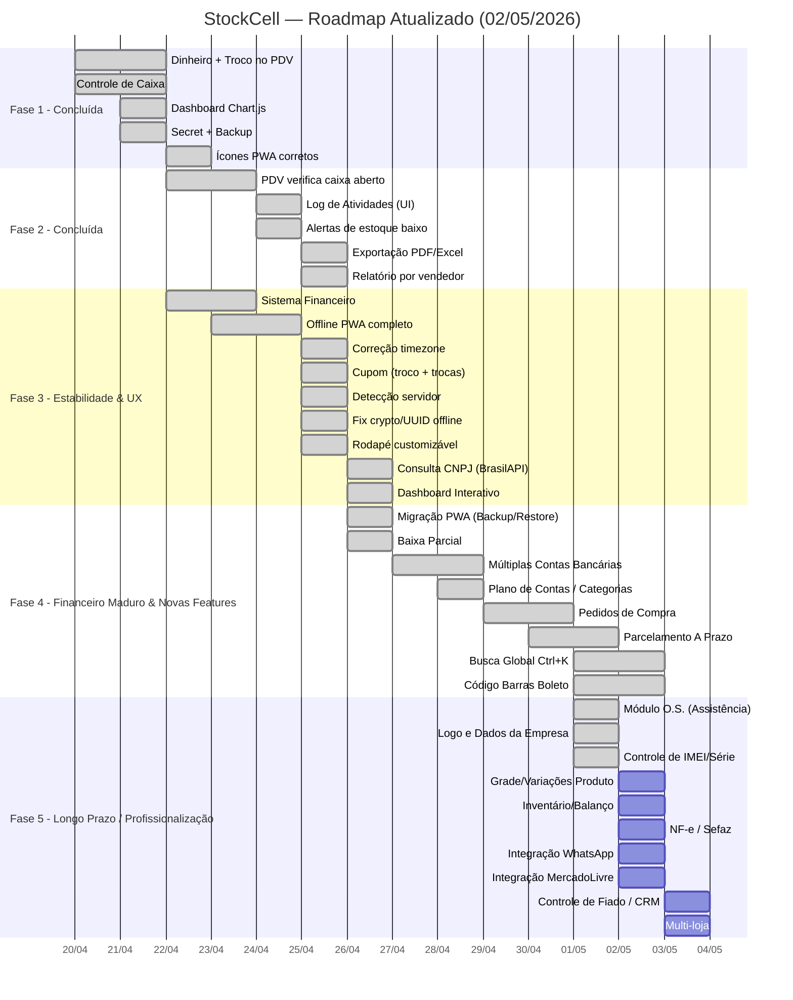

# Roadmap - StockCell PWA

## Fase 1 — Fundação e Offline-First (100% Concluído ✅)
- [x] Correção de importação de banco de dados e testes unitários.
- [x] Refatoração do `server.js` (modularização de rotas).
- [x] Melhoria de performance e Service Worker (Cache Dinâmico).
- [x] IndexedDB para armazenamento local e fila de requisições offline.
- [x] Sincronização em background quando a rede volta (Sync Engine).
- [x] Ajustes de ícones e Manifest PWA para instalação.

## Fase 2 — Refinamentos e Produtividade (100% Concluído ✅)
### 1. 🔒 PDV e Caixa
- [x] Criar endpoint no frontend para checar status do caixa.
- [x] Implementar regra de bloqueio no PDV.
- [x] Exibir banner de aviso "Caixa Fechado" na tela do PDV se aplicável.
- [x] Switch de controle "Bloqueio Rigoroso vs Flexível" em Configurações.

### 2. 📝 Log de Atividades
- [x] Adicionar logs nas rotas: Abertura/Fechamento de Caixa, Cancelamento de Venda, Exclusões e Login.
- [x] Backend: Criar rota `GET /api/logs`.
- [x] Frontend: Criar `logs.js` (UI) com tabela e filtros.
- [x] Adicionar ao Sidebar e rotas do app.

### 3. 🔔 Alertas de Estoque Baixo
- [x] Adicionar ícone de Sino no header (`header.js`).
- [x] Criar lógica no `app.js`/`header.js` para buscar `/api/stock/low-stock` periodicamente (1 min).
- [x] Atualizar o badge vermelho do sino com a quantidade.

### 4. 📤 Exportação
- [x] Criar `Utils.exportToCSV` no frontend.
- [x] Adicionar botão "Exportar CSV" na tela de Relatórios (Aba Vendas, Produtos, etc).
- [x] Adicionar lógica de conversão de tabela para CSV e download.

### 5. 👥 Relatório por Vendedor
- [x] Backend: Adicionar rota `/api/reports/sellers` (agrupar vendas por `user_id`).
- [x] Frontend: Adicionar aba "Vendedores" em `reports.js`.
- [x] Renderizar tabela com os dados de faturamento por vendedor e botão de exportar.

## Fase 3 — Estabilidade & UX (100% Concluído ✅)
### 1. 💰 Sistema Financeiro
- [x] Tabela `transactions` para Contas a Pagar e Receber.
- [x] Integração PDV → Financeiro (gerar "Contas a Receber" em vendas A Prazo).
- [x] API e frontend para gerenciar transações financeiras.

### 2. 📱 Offline PWA Completo
- [x] IndexedDB com sincronização bidirecional (push/pull).
- [x] Vendas offline com fila de sincronização.
- [x] Login offline com hash local de credenciais.
- [x] Caixa operacional em modo offline (abrir, fechar, sangria, suprimento).

### 3. 🕐 Correção de Fuso Horário
- [x] Substituir `toISOString()` por datas locais em `sync.js`, `sales.js`, `finance.js`.
- [x] Garantir que `created_at` reflita o horário brasileiro no servidor.

### 4. 🧾 Cupom e Transparência Fiscal
- [x] Campos `cash_received` e `cash_change` no banco e na API.
- [x] Exibir "Valor Recebido" e "Troco" no cupom impresso.
- [x] Mensagem "Em caso de trocas, apresente este cupom" no rodapé.

### 5. 🟢 Detecção de Conectividade (Servidor vs Internet)
- [x] Substituir `navigator.onLine` (internet) por `window.serverIsReachable` (servidor).
- [x] Separar erros de rede de erros de processamento no `api.js`.
- [x] Polling a cada 30s para reconectar automaticamente ao servidor.
- [x] Remover eventos `online`/`offline` do navegador (irrelevantes em rede local).

### 6. 🔐 Fix crypto.randomUUID em HTTP
- [x] Criar `Utils.generateUUID()` como fallback seguro para contextos não-HTTPS.
- [x] Substituir `crypto.randomUUID()` em todo o módulo offline.

### 7. 📱 Rodapé Customizável
- [x] Tela em Configurações para escolher módulos do bottom nav.
- [x] Suporte a mais de 5 itens (até o limite da tela).

### 8. 🔍 Consulta CNPJ via BrasilAPI
- [x] Auto-preenchimento de dados do fornecedor ao digitar CNPJ.
- [x] Busca via `brasilapi.com.br/api/cnpj/v1/{cnpj}`.
- [x] Preenche razão social, nome fantasia, telefone, email, endereço.

### 9. 📊 Dashboard Interativo e UX de Listas
- [x] KPIs do Dashboard clicáveis com roteamento inteligente (Estoque Baixo vai para a aba correta).
- [x] Modal de Vendas de Hoje.
- [x] Modal de Detalhes de Venda ao clicar na tabela de Últimas Vendas.
- [x] Pré-preenchimento da tela de Entrada de Estoque ao clicar na lista de visão geral.

## Fase 4 — Financeiro Maduro & Novas Features (Em Andamento 🚀)
### Financeiro Avançado
- [x] Plano de Contas / Categorização (água, luz, fornecedores, etc).
- [x] Baixas Parciais (permitir pagamento parcial de uma transação e gerar saldo devedor).
- [x] Múltiplas Contas / Caixas (controle de saldo por conta bancária, gaveta do caixa, etc).
- [x] Transações Recorrentes (aluguel, internet mensal).
- [ ] Anexos / Comprovantes (upload de recibo ou boleto na transação).

### Novas Funcionalidades Gerais
- [x] Ferramenta de Migração PWA (Exportação de JSON no celular e Restauração no PC para contornar bloqueios de IP).
- [x] Pedidos de Compra (gerar pedidos e alimentar contas a pagar automaticamente).
- [x] Parcelamento A Prazo (dividir vendas em parcelas com múltiplos vencimentos).

## Fase 5 — Longo Prazo / Profissionalização (Em Andamento 🚀)
### Módulo Assistência Técnica (O.S.)
- [x] Workflow Completo e Kanban.
- [x] Controle Inteligente de Peças vs Serviços.
- [x] Relatórios modernos de orçamento.
- [x] Personalização da Empresa (Logo e Dados nos Relatórios).
- [x] Código de Barras de Boleto (leitura e baixa rápida em Contas a Pagar).
- [x] Baixa de títulos simplificada pelo clique na lista financeira.
- [x] Busca Global `Ctrl+K` (buscar produtos, clientes, vendas em qualquer tela).

## Fase 5 — Longo Prazo / Profissionalização (Planejamento ⏳)
### 1. Gestão Avançada de Estoque
- [x] Controle de IMEI e Números de Série (rastreio individual para celulares e peças caras).
- [ ] Grade de Produtos / Variações (cores, tamanhos, modelos agrupados no mesmo produto).
- [ ] Inventário e Balanço Patrimonial (contagem física vs. sistema com leitura de código de barras).
- [ ] Múltiplos Locais de Estoque (ex: Loja vs. Depósito).

### 2. Módulo de Assistência Técnica (O.S.)
- [x] Criação de Ordem de Serviço (dados do aparelho, defeito, laudo, senha).
- [x] Fluxo de Status (Orçamento, Aguardando Peça, Consertado, Entregue).
- [x] Consumo automático de peças do estoque nas O.S.
- [ ] Aprovação de orçamento digital via link/WhatsApp.

### 3. CRM e Relacionamento com Cliente
- [ ] Controle de Crediário/Fiado (limite de crédito por cliente e bloqueio de inadimplentes).
- [ ] Histórico 360º do Cliente (compras, O.S. antigas, ticket médio, dias sem comprar).
- [ ] Sistema de Pontuação / Cashback simples.

### 4. Omnichannel e Integrações
- [ ] Integração Mercado Livre / Shopee (sincronização de estoque e pedidos).
- [ ] Integração WhatsApp (envio automático de cupons, cobranças e status de O.S.).
- [ ] Catálogo Digital / Link de Pagamento (geração de carrinho pelo WhatsApp).

### 5. Emissão Fiscal e Gestão Corporativa
- [ ] Emissão de NFC-e / SAT e NF-e via Sefaz.
- [ ] Impressão de Etiquetas Térmicas de código de barras personalizadas.
- [ ] Comissões Avançadas (por produto, categoria ou vendedor).
- [ ] Permissões de Usuário Granulares (ex: bloquear desconto, ocultar margem de lucro).
- [ ] Multi-loja (gestão centralizada de diversas filiais).
